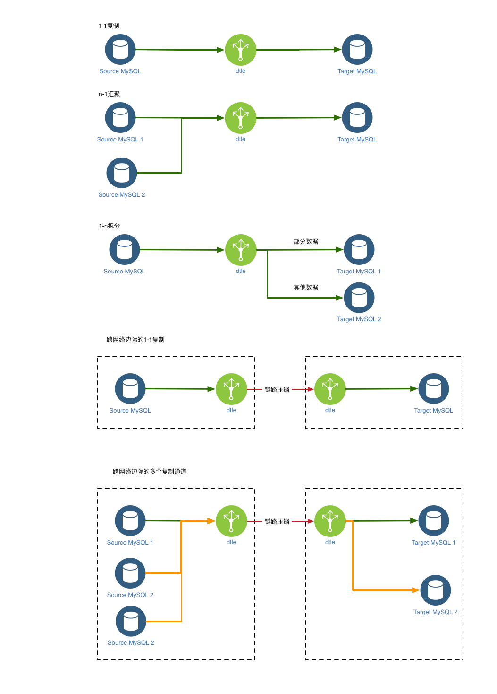

# 1.0 MySQL的单向复制/聚合/分散
如下图, dtle 支持 MySQL 单向数据复制的常见场景如下: 
- 按数据源/数据目标的映射关系划分
	- 支持1:1的复制
	- 支持n:1的数据汇聚, 将多个数据源的数据 聚合到 同一个数据目标
	- 支持1:n的数据拆分, 将一个数据源的数据 拆分到 多个数据目标
- 按网络类型划分
	- 支持网络内的数据传输
	- 支持跨网络边际的数据传输 (可使用 链路压缩/链路限流 等功能)
- 按集群规模划分
	- 可配置 单一dtle实例 处理 单一数据通道
	- 可配置 dtle集群 处理 多个数据通道

 