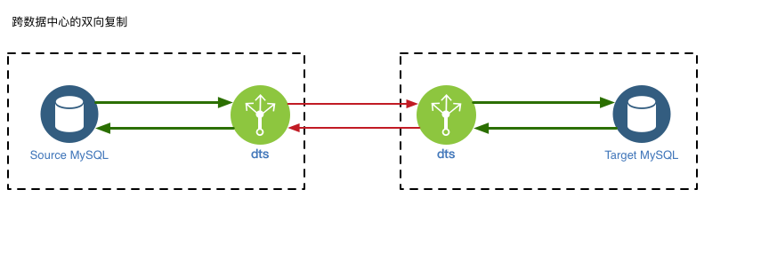

# 1.1 跨数据中心的双向复制

如下图, dtle支持MySQL间的双向复制, 其普遍场景是用于跨数据中心的数据双向同步.

 

其中: 
- dtle 会对数据的回环状况进行判断, 不会重复传输同一事务.
- dtle 在传输过程中维持数据的事务性, 对于数据源的事务产生的数据, 在数据目标端是以相同的事务方式进行回放. 对于双写的场景, 目标端不会受到不完整的事务的影响.
- dtle 在数据链路上, 可使用压缩/限速等功能, 更适合于跨数据中心的场景.