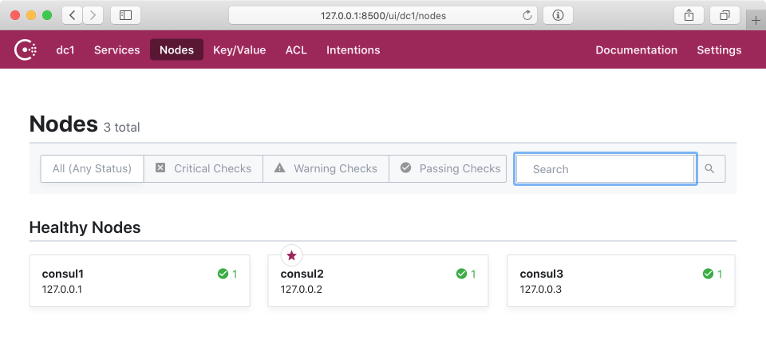
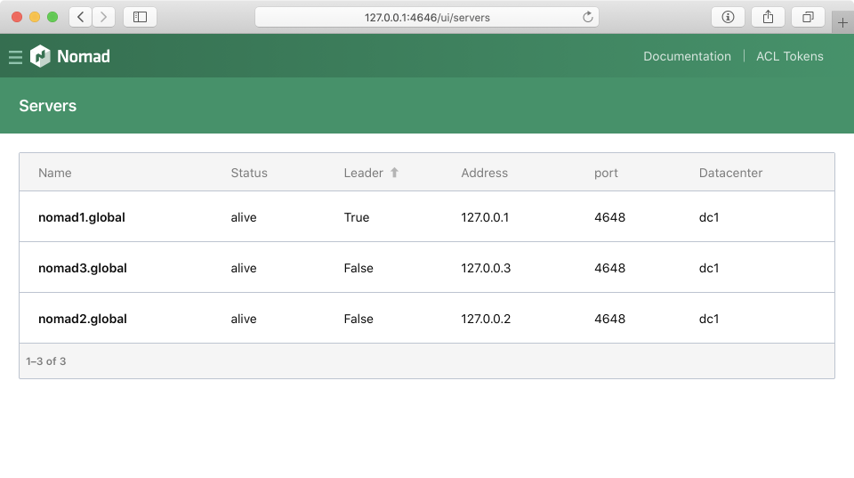
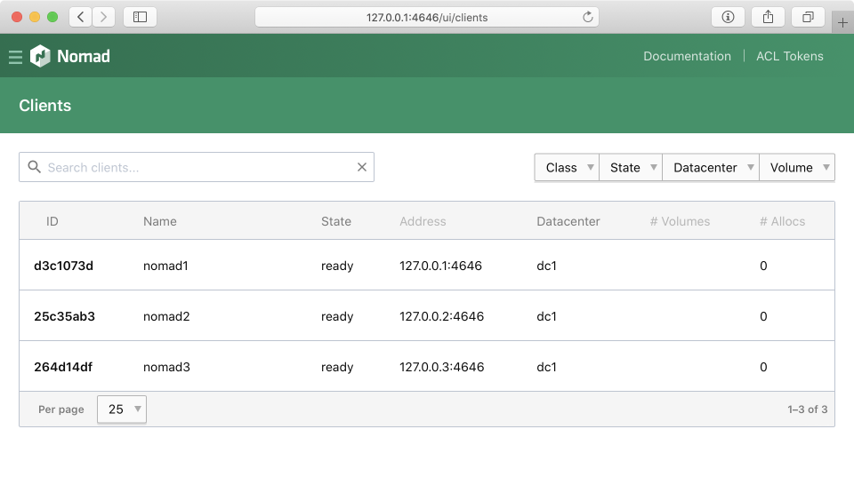

# 多server部署配置

nomad可以配置成
- 单server，单client
- 单server，多client
- 多server，多client

其中
- server管理job数据
- server数量为奇数，一般使用1或3个，不超过5个。
- client（运行dtle插件）执行job
- client数量任意
- server和client可运行于同一进程，也可单独启动server或client

需另外运行consul，用于
- nomad 服务发现（多节点自动注册）
- dtle 保存运行信息

一般每个nomad server搭配一个consul server，两者运行于同一台主机。

下面描述 **多server多client配置** 。

## consul配置

修改 /etc/dtle/consul.hcl

```
# Rename for each node
node_name = "consul1"

# 配置IP

# Address that should be bound to for internal cluster communications
bind_addr = "0.0.0.0"
# Address to which Consul will bind client interfaces, including the HTTP and DNS servers
client_addr = "127.0.0.1"
advertise_addr = "127.0.0.1"

# ... 省略未更改项

bootstrap_expect = 3
retry_join = ["127.0.0.1", "127.0.0.2", "127.0.0.3"] # will use default serf port
```

为另外两个节点也做出修改。

全部启动后，从Web UI中可以看出，组成了3节点consul，其中一个为Leader。



## nomad配置

修改 /etc/dtle/nomad.hcl：

```
name = "nomad1" # rename for each node
# ... 省略未更改项
advertise {
  http = "127.0.0.1:4646"
  rpc  = "127.0.0.1:4647"
  serf = "127.0.0.1:4648"
}
server {
  enabled          = true
  bootstrap_expect = 3
}
consul {
  address = "127.0.0.1:8500"
}
plugin "dtle" {
  config {
    # ... 省略未更改项
    nats_bind = "127.0.0.1:8193"
    nats_advertise = "127.0.0.1:8193"
    consul = "127.0.0.1:8500"
    nomad_addr = "127.0.0.1:4646" # compatibility API need to access a nomad server
  }
}
```

全部启动后, nomad将自动向consul注册，组成集群：




