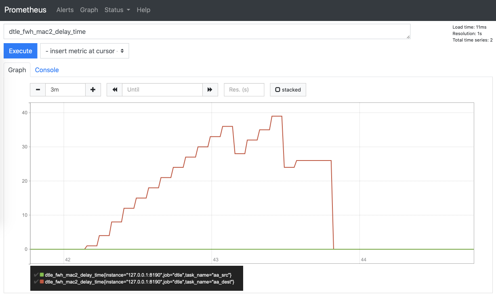
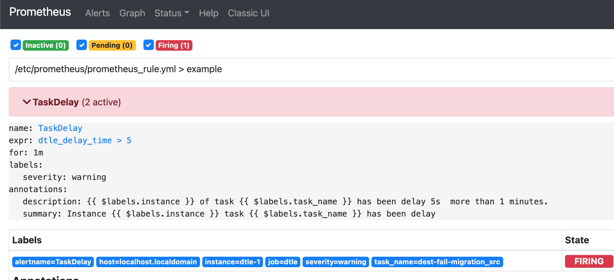

# 延迟监控告警示例
   [Prometheus](https://prometheus.io)可直观查看监控项并记录历史值,
   可通过[搭建Prometheus](./3.4.1_delay_alert.md#Prometheus配置)查看延迟情况,
   [Alertmanager](https://prometheus.io/docs/alerting/latest/alertmanager/) 可针对异常监控项及时发出告警信息,
   通过[配置Alertmanager](./3.4.1_delay_alert.md#Alertmanager配置)对延迟异常任务发出告警
    

## Prometheus配置

查看监控项并记录历史值

- 准备配置文件 `prometheus.yml`：
```

# 设定alertmanager和prometheus交互的接口，即alertmanager监听的ip地址和端口
alerting:
 alertmanagers:
 - static_configs:
   - targets: ["127.0.0.1:9093"] 

# 告警规则文件
rule_files:
  - 'prometheus_rule.yml'

scrape_configs:
  - job_name: 'dtle'

    # Override the global default and scrape targets from this job every 5 seconds.
    scrape_interval: 5s

    static_configs:
      - targets: ['127.0.0.1:8190','127.0.0.2:8190'] # 填写dtle兼容层的地址。可填多个。

```

- 准备告警规则文件 `prometheus_rule.yml`
```
groups:
- name: simple_example
  rules:

  # Alert for task that is delay more than 5s for >1 minutes.
  - alert: TaskDelay
    expr:  dtle_delay_time > 5
    for: 1m
    labels:
      severity: warning
    annotations:
      summary: "task {{ $labels.task_name }} has delay"
      description: "Task {{ $labels.task_name }} of instance {{ $labels.instance }} has delay 5s  more than 1 minutes."
```

- 使用docker运行Prometheus：
```
docker run \
    -p 9090:9090 \
    -v ${PWD}/prometheus.yml:/etc/prometheus/prometheus.yml \
    -v ${PWD}/prometheus_rule.yml:/etc/prometheus/prometheus_rule.yml \
    prom/prometheus
```

- 然后浏览器访问 http://127.0.0.1:9090, 并查询(Prometheus提供补全)需要的监控项。



- 访问http://127.0.0.1:9090/alerts, 获取当前告警规则/内容



## Alertmanager配置

针对任务延迟异常发送告警

- 创建配置文件 alertmanager.yml 配置示例如下
 ```
global:
  smtp_smarthost: 'smtp.gmail.com:587'
  smtp_from: 'SENDER_ACCOUNT'
  smtp_auth_username: 'SENDER_ACCOUNT'
  smtp_auth_password: 'email smtp verify password'
  smtp_require_tls: false
route:
  # If an alert has successfully been sent, wait 'repeat_interval' to resend them.
  repeat_interval: 10s
  #  A default receiver
  receiver: team-dtle-mails

receivers:
  - name: 'team-dtle-mails'
    email_configs:
    - to: 'receiver@actionsky.com'
 ```
- 启动alertmanager
```
docker run -p 9093:9093 -v  ${PWD}/alertmanager.yml:/etc/alertmanager/alertmanager.yml prom/alertmanager
```


- 根据配置延迟5s以上并持续1min时,receiver@actionsky.com 邮箱收到告警如下:

```
[1] Firing
Labels
alertname = TaskDelay
host = localhost.localdomain
instance = dtle-1
job = dtle
severity = warning
task_name = dest-fail-migration_src
Annotations
description = Task dest-fail-migration_src of instance dtle-1  has delay 5s more than 1 minutes.
summary = task dest-fail-migration_src has delay
Source
```


