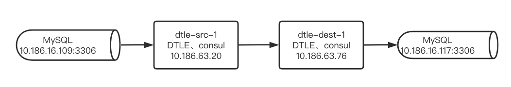
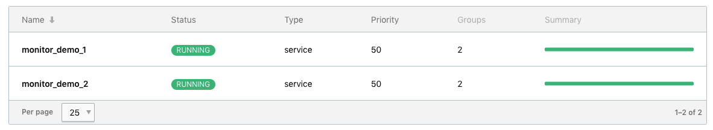
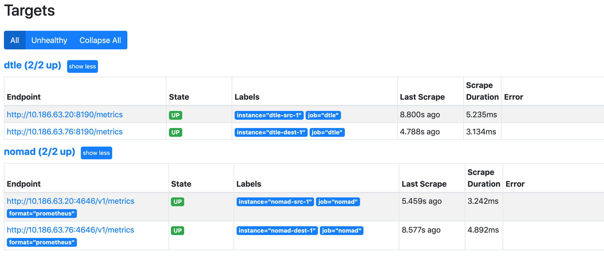
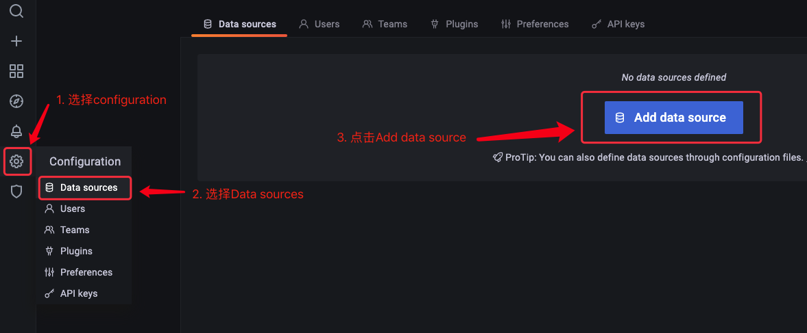
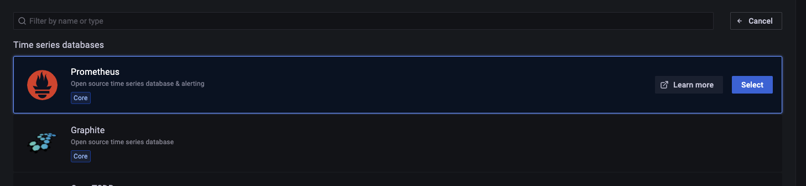
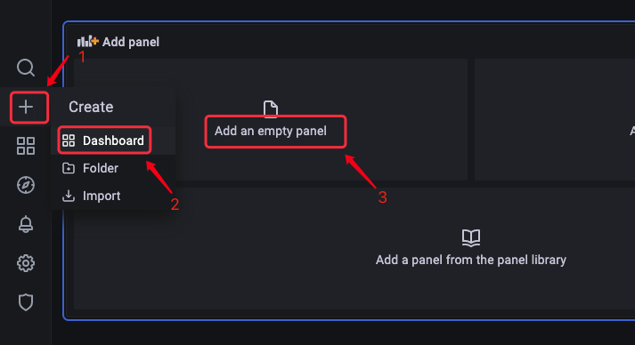
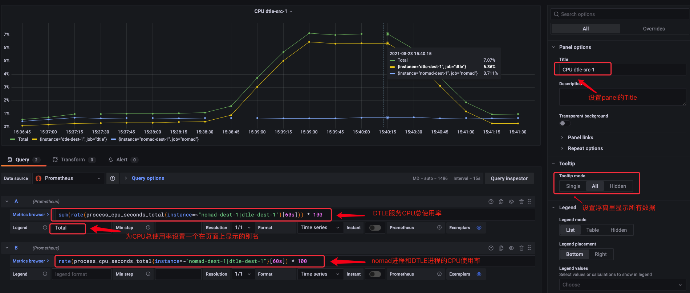
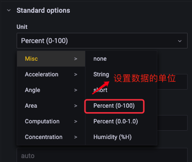
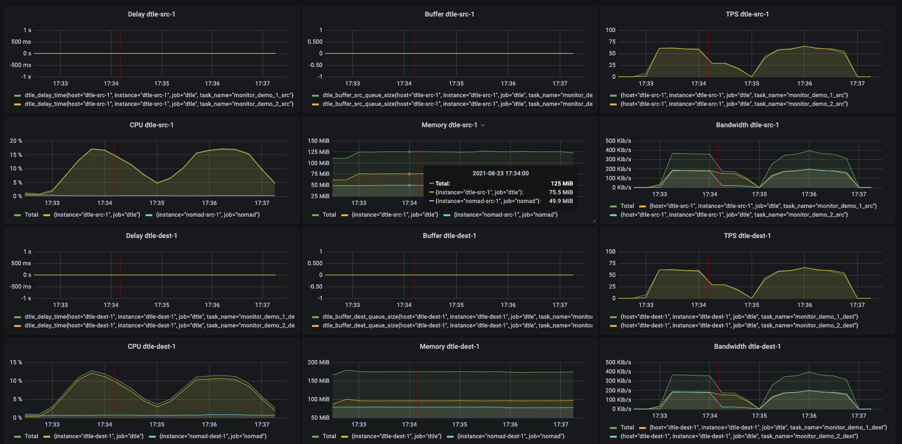

# 如何搭建DTLE的监控系统

## 背景：

虽然在DTLE的文档里提供各种监控项的介绍，但是对于不熟悉prometheus和grafana配置的同学来说上手还是有些难度的。今天我就来DTLE 3.21.07.0来搭建一个DTLE的监控系统。

## 一、搭建DTLE运行环境

- 配置两个节点的DTLE集群来演示,其拓扑如下:



在修改DTLE配置文件的时候需要注意以下两点：

1. 开启DTLE的监控，确保publish_metrics的值为ture
2. 开启nomad的监控，确保正确配置[telemetry](https://www.nomadproject.io/docs/configuration/telemetry)

这里以dtle-src-1的配置为例，具体配置参考[节点配置](https://github.com/actiontech/dtle-docs-cn/blob/master/4/4.1_node_configuration.md):

```
# DTLE 3.21.07.0中nomad升级为1.1.2，需要添加如下配置使nomad提供监控数据
# 之前版本的DTLE无需添加此配置
telemetry {
  prometheus_metrics         = true
  collection_interval        = "15s"
}

plugin "dtle" {
  config {
    data_dir = "/opt/dtle/var/lib/nomad"
    nats_bind = "10.186.63.20:8193"
    nats_advertise = "10.186.63.20:8193"
    # Repeat the consul address above.
    consul = "10.186.63.76:8500"

    # By default, API compatibility layer is disabled.
    api_addr = "10.186.63.20:8190"   # for compatibility API
    nomad_addr = "10.186.63.20:4646" # compatibility API need to access a nomad server

    publish_metrics = true
    stats_collection_interval = 15
  }
}
```

- 添加两个job模拟两个MySQL实例之间传输数据

  

## 二、部署prometheus

- 准备prometheus配置文件同时接收nomad和DTLE的metrics
- DTLE监控labels:instance的值建议设置为DTLE服务器的hostname

```yaml
shell> cat /path/to/prometheus.yml
global:
  scrape_interval:     15s # Set the scrape interval to every 15 seconds. Default is every 1 minute.
  evaluation_interval: 15s # Evaluate rules every 15 seconds. The default is every 1 minute.

scrape_configs:
  - job_name: 'nomad'
    scrape_interval: 15s
    metrics_path: '/v1/metrics'
    params:
      format: ['prometheus']
    static_configs:
      - targets: ['10.186.63.20:4646']
        labels:
          instance: nomad-src-1
      - targets: ['10.186.63.76:4646']
        labels:
          instance: nomad-dest-1

  - job_name: 'dtle'
    scrape_interval: 15s
    metrics_path: '/metrics'
    static_configs:
      - targets: ['10.186.63.20:8190']
        labels:
          instance: dtle-src-1
      - targets: ['10.186.63.76:8190']
        labels:
          instance: dtle-dest-1
```

- 利用docker部署prometheus服务

  ```
  shell> docker run -itd -p 9090:9090 --name=prometheus --hostname=prometheus --restart=always -v /path/to/prometheus.yml:/etc/prometheus/prometheus.yml prom/prometheus
  ```

- 在浏览器上访问prometheus的页面 http://${prometheus_server_ip}:9090/targets 验证配置生效

  

## 三、部署grafana

- 利用docker部署grafana服务

  ```
  shell> docker run -d --name=grafana -p 3000:3000 grafana/grafana
  ```

- 在浏览器上访问grafana的页面 http://${grafana_server_ip}:3000 ，使用默认用户 admin/admin登录

- 配置添加数据源

  
  - 选择添加promethues

    

  - 只需将promethues的访问地址添加到URL中，点击“sava & test”按钮

  

- 添加panel

  

- 以添加一个CPU使用率监控为例配置一个panel

  



## 四、常用的监控项

nomad所有监控项： https://www.nomadproject.io/docs/operations/metrics

DTLE所有监控项：https://actiontech.github.io/dtle-docs-cn/3/3.4_metrics.html

|             说明              | 公式示例                                                     |           单位           |
| :---------------------------: | ------------------------------------------------------------ | :----------------------: |
|        CPU使用率(总计)        | <code>sum(rate(process_cpu_seconds_total{instance=~"nomad-src-1 &#x7C; dtle-src-1"}[60s])) * 100</code> |  Misc / Percent(0-100)   |
|       CPU使用率(DTLE )        | `rate(process_cpu_seconds_total{instance="dtle-src-1"}[60s]) * 100` |  Misc / Percent(0-100)   |
|       CPU使用率(nomad)        | `rate(process_cpu_seconds_total{instance="dtle-src-1"}[60s]) * 100` |   Misc /Percent(0-100)   |
|        内存使用(总计)         | <code>sum(process_resident_memory_bytes{instance=~"nomad-src-1 &#x7C; dtle-src-1"}) /1024 /1024</code> |     Data / mebibyte      |
|        内存使用(DTLE )        | `process_resident_memory_bytes{instance="dtle-src-1"} /1024 /1024` |     Data / mebibyte      |
|        内存使用(nomad)        | `process_resident_memory_bytes{instance="nomad-src-1"} /1024 /1024` |     Data / mebibyte      |
|     带宽(总计 - 源端发送)     | `sum(increase(dtle_network_out_bytes{host="dtle-src-1"}[30s]) /30 /1024) * 8` | Data rate / kibibits/sec |
|  带宽(按task分组 - 源端发送)  | `increase(dtle_network_out_bytes{host="dtle-src-1"}[30s]) /30 /1024 * 8` | Data rate / kibibits/sec |
|    带宽(总计 - 目标端接收)    | `sum(increase(dtle_network_in_bytes{host="dtle-dest-1"}[30s]) /30 /1024) * 8` | Data rate / kibibits/sec |
| 带宽(按task分组 - 目标端接收) | `increase(dtle_network_in_bytes{host="dtle-dest-1"}[30s]) /30 /1024 * 8` | Data rate / kibibits/sec |
|        数据延迟(源端)         | `dtle_delay_time{host="dtle-src-1"}`                         |    Time / seconds(s)     |
|       数据延迟(目标端)        | `dtle_delay_time{host="dtle-dest-1"}`                        |    Time / seconds(s)     |
|           TPS(源端)           | `irate(dtle_src_extracted_incr_tx_count[30s])`               |       Misc / none        |
|          TPS(目标端)          | `irate(dtle_dest_applied_incr_tx_count[30s])`                |       Misc / none        |
|         Buffer(源端)          | `dtle_buffer_src_queue_size`                                 |       Misc / none        |
|        Buffer(目标端)         | `dtle_buffer_dest_queue_size`                                |       Misc / none        |

## 五、最后创建多个panel同时展示



