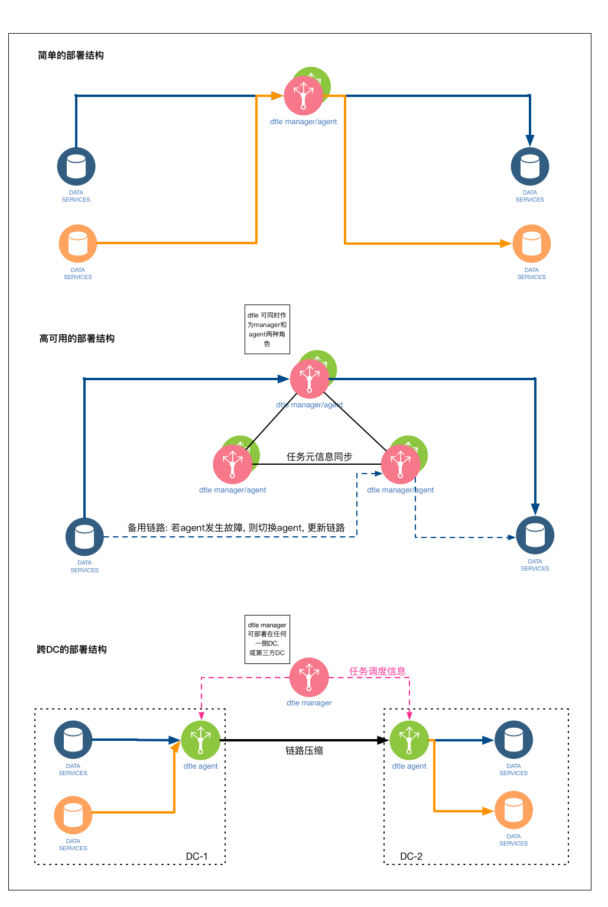

# 3.5 部署结构

如上图, nomad (运行dtle插件)支持多种不同的部署结构, 其中: 
- 简单的部署结构: 
	- 适用于简单的场景, 用一个nomad节点同时作为server (管理节点)和client (执行节点，运行dtle插件)
	- 一个节点可同时处理多个传输链路
- 高可用的部署结构: 
	- 适用于对可用性较高的场景, 将 nomad 和 consul 进行三节点集群部署, 任务元数据信息在集群中同步
	- 一个 nomad 节点可同时作为 server 和 client, 也可将 server 和 client 分开部署
	- 当server发生故障时, 传输任务会转移到其他server执行 (需要server集群存活一半以上)
	- 当client发生故障时, 传输任务会转移到其他client执行
- 跨DC的部署结构
	- 适用于多个数据中心间的数据同步
	- server集群可部署在任一数据中心, 或第三方数据中心
	- 源数据库和目标数据库 **不必要**保障 直接网络连通
	- client需部署在网络边界上
